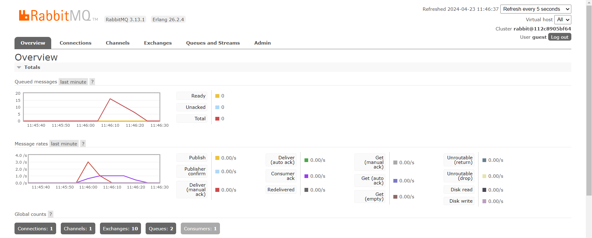

# QnA
1. Apa itu amqp?
    - AMQP merupakan singkatan dari Advanced Message Queuing Protocol. Ini adalah protokol lapisan aplikasi standar terbuka untuk _middleware_ berorientasi pesan. Dalam istilah yang lebih sederhana, ini adalah protokol yang memungkinkan sistem perangkat lunak yang berbeda berkomunikasi satu sama lain dengan mengirim dan menerima pesan.

2. Apa arti dari ini? guest:guest@localhost:5672, apa itu guest pertama dan apa maksud dari guest kedua? dan apa arti localhost:5672? 
    - "guest:guest@localhost:5672" adalah format umum yang digunakan untuk mengakses server AMQP. 
    - "guest" pertama adalah nama pengguna (_username_) yang digunakan untuk mengakses server. 
    - "guest" (kedua) adalah kata sandi (_password_) yang terkait dengan nama pengguna tersebut. 
    - "localhost:5672" adalah alamat server dan _port_ tempat server AMQP berjalan. 
    - "localhost" merujuk pada mesin tempat kita menjalankan aplikasi atau layanan AMQP, dan "5672" adalah nomor _port_ default yang digunakan oleh server AMQP. 
    - Jadi, secara keseluruhan, "guest:guest@localhost:5672" mengidentifikasi pengguna yang ingin mengakses server AMQP di mesin lokal (_localhost_) menggunakan nama pengguna "guest" dan kata sandi "guest", yang berjalan di _port_ 5672.
3. _Slow Simulation_
    - _Queue_ berjumlah 20 karena setiap _run_ akan mengirimkan lima data ke dalam _queue_. 

4. _Running with Three Consoles_
     - Lonjakan grafik dapat dikatakan lebih menurun dibandingkan ketika menjalankan satu konsol _subscriber_ karena dengan adanya tiga _subscriber_, terjadi pembagian komputasi sehingga memerlukan total queue juga akan berkurang. 

5. Improvisasi Kode
    - _Code Duplication_: Metode `publish_event` dipanggil beberapa kali dengan data yang serupa. Ini bisa direfaktor menjadi sebuah _loop_ yang mengulangi daftar pengguna.
    - _Hardcoded Values_: _Connection string_, _event name_, and _user data_ di-_hardcode_. Lebih baik dipindahkan ke dalam _file_ konfigurasi atau _env file_.
    - _Unimplemented Function_: Fungsi `get_handler_action` belum diimplementasikan dan hanya memiliki panggilan todo!(). Ini harus diimplementasikan atau dihapus jika tidak diperlukan.